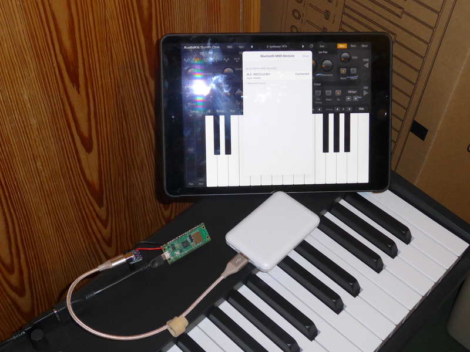

# ble-midi2usbhost
A Pico W Bluetooth LE MIDI to USB Host adapter for any class compliant USB MIDI device

This project uses the native Raspberry Pi Pico W USB port as a USB MIDI host port
and it uses the Bluetooth LE capability of the Pico W's CYW43 WiFi/Bluetooth module
to create a Bluetooth LE MIDI GATT Server. You can power the Raspberry Pi Pico W
board with any 5V USB C power supply. If you choose to use a 5V phone charger
battery pack, make sure that the attached USB MIDI device is bus powered and
uses enough power to keep the phone charger battery pack from shutting off
automatically.

Because some BLE-MIDI controller apps use a fixed, 0-value timestamp for every message,
this code does not attempt to synchronize timestamps to the clock.

This is both a hardware and software project. Please test carefully any hardware you
build before you connect your expensive MIDI device to this project. Also be aware that
the only current limiting or short circuit protection this project provides for its
USB host port comes from the external 5V power source.

If you have problems or need help, please file issues in the Issues tab on the project
[home page](https://github.com/rppicomidi/ble-midi2usbhost). If you have specific
Bluetooth issues and can attach an air trace, that can help a lot. If
you find a bug and have a fix for it, pull requests are welcome.

# Known Issues
## 26-Jul-2023:
### iPad GarageBand
The iPad GarageBand app Advanced Settings shows the ble-midi2usbhost Pico W Bluetooth successfully connected, but MIDI data does not play GarageBand virtual instruments.

- Workaround: Use a different iPad BLE-MIDI app like MIDI Wrench or
Synth One to connect to the ble-midi2usbhost Pico W Bluetooth first.
After that, GarageBand virtual instruments will recognize BLE-MIDI messages.

In my mind, this is an issue with the GarageBand App. GarageBand on my
Mac Mini running Monterey works fine. So too do all other BLE-MIDI apps I
have tested on my iPad. If this is wrong, please file an issue in this
project.

### iPad Bluetooth Disconnect Does Not Fully Disconnect
If the Pico W pairs, then disconnects, with an iPad app, you have
to fully exit the app and wait a few seconds before you can connect
again, or you have to shut off iPad Bluetooth for about a second,
then turn it on. It seems the iPad only disconnects from the GATT
layer but does not fully disconnect from the Pico W Bluetooth.

By contrast, on my Mac Mini running Monterey, disconnect fully
disconnects, so reconnecting is reliable.

### Android Bluetooth Reconnection unreliable
If the Pico W Bluetooth pairs, then disconnects, from the Android App
TouchDAW, reconnection does not work correctly. Sometimes you have
to reboot the phone to get it to connect again. I am not sure if the
issue is with ble-midi2usbhost, my cheap phone, TouchDAW, or some
combination of these.

### Active Sensing is Disabled
If the MIDI keyboard or other device connected via the ble-midi2usbhost
USB Host port sends the Active Sensing message, ble-midi2usbhost
filters it out. This is done on purpose. In the future, Active Sensing
will be supported locally. We don't need to waste Bluetooth bandwidth
on this message.

### Can't Pair with Linux
Most Linux distributions use the BlueZ Bluetooth stack. By default,
BLE-MIDI is disabled. Enabling requires rebuilding the BlueZ stack
with the `--enable-midi` option. You can find old instructions for
doing this on the Internet. I have not tried this.

### Can't Pair with Windows
I believe BLE-MIDI is not supported in Windows unless the device has its own
device driver installed or you are using software like Cubase that supports
WinRT MIDI. I have not tried this.

# Hardware



The photo shows a Pico W with a microUSB to USB A adapter connected to an Arturia Keylab Essential 88 USB MIDI keyboard. The Pico W is also wired to a USB C 
breakout board connected to a USB C to USB A cable that is
connected to a 5000mAh phone charger battery. The keyboard is bus powered, so
the system draws enough power to prevent the phone charger battery from shutting
down automatically. An iPad running AudioKit Synth One is connected to the Pico W
via BLE-MIDI.

## Bill of Materials
I do not get money from hardware vendors. The links to hardware vendors are for illustration
and are not endorsements.

1. A Pico W board see the [Raspberry Pi website](https://www.raspberrypi.com/documentation/microcontrollers/raspberry-pi-pico.html) for more info
2. A USB C breakout board (e.g. [Adafruit 4090](https://www.adafruit.com/product/4090))
3. A microUSB OTG to USA A adapter (e.g. [Adafruit 1099](https://www.adafruit.com/product/1099))
4. Wire and solder
5. 5V USB C power supply (e.g., a battery or AC cell phone charger) and USB C charging cable
6. 3-pin 0.1" spacing square pin header for connecting the picoprobe debug pins and ground (optional)
7. 2-pin 0.1" spacing square pin header for connecting the picoprobe ground pins (optional)
8. A Pico board board programmed as a picoprobe and populated with headers for wiring to the Pico W board (optional)
9. 5 Jumper wires for connecting the picoprobe to the Pico W (optional)
10. A microUSB cable to connect the picoprobe to your debug host computer

## Wiring
1. Solder a wire between pin 40 (VBUS pin) of the Pico W and the VBUS pin of the USB C breakout board
2. Solder a wire between pin 38 (GND pin) of the Pico W and the GND pin of the USB C breakout board
3. Plug a USB C power cable to the USB C breakout board (but do not activate the 5V power yet).
4. If you are using a second Pico board programmed picoprobe  for debug and serial port
   1. Solder the 2-pin header to pins 1 and 2 of the Pico W board
   2. Solder the 3-pin header to the 3 debug pins of the Pico W board
   3. Attach the microUSB cable to the picoprobe, but do not attach it to the host computer yet.
   4. Use jumper wires to connect the picoprobe to the Pico W board per the instructions in Appendix A of the
[Getting Started with Raspberry Pi Pico](https://datasheets.raspberrypi.com/pico/getting-started-with-pico.pdf) document

# Software
The following instructions assume that your Pico SDK code is stored in
`${PICO_SDK_PATH}` and that your project source tree will be in `${PICO_PROJ}/ble-midi2usbhost`. As of this writing, you will need to install a forked version
of the `tinyusb` library (See below).
## Getting the project source code
```
cd ${PICO_PROJ}
git clone https://github.com/rppicomidi/ble-midi2usbhost.git
cd ble-midi2usbhost
git submodule update --recursive --init
mkdir build
```
When you are done with these steps, your source tree should look like this
(library directories, but not files, are shown for brevity).
```
ble-midi2usbhost/
    |
    +--lib
    |   |
    |   +--pico-w-ble-midi-lib/
    |   |
    |   +--ring-buffer-lib/
    |
    +--ble-midi2usbhost.c
    |
    +--ble-midi2usbhost.gatt
    |
    +--ble-midi2usbhost.jpg
    |
    +--btstack_config.h
    |
    +--CMakeLists.txt
    |
    +--LICENSE
    |
    +--pico_sdk_import.cmake
    |
    +--README.md
    |
    +--tusb_config.h
```
## Installing a tinyusb library that supports USB MIDI Host
The Pico SDK uses the main repository for `tinyusb` as a git submodule. Until the USB Host driver for MIDI is
incorporated in the main repository for `tinyusb`, you will need to use the latest development version in pull
request 1627 forked version. To make matters worse, this pull request is getting old and it is rapidly
diverging from the mainline of tinyusb, so I have been updating this pull request in my local workspace. I
have pushed my changes up to my own fork of `tinyusb` that I keep in a branch called `pr-midihost`. Sorry. I know. Yuk.

1. If you have not already done so, follow the instructions for installing the Raspberry Pi Pico SDK in Chapter 2 of the
[Getting started with Raspberry Pi Pico](https://datasheets.raspberrypi.com/pico/getting-started-with-pico.pdf)
document. In particular, make sure `PICO_SDK_PATH` is set to the directory where you installed the pico-sdk.
2. Set the working directory to the tinyusb library
```
cd ${PICO_SDK_PATH}/lib/tinyusb
```
3. Create a git remote to point to my fork of tinyusb and get my updated branch of Pull Request 1627, which is called pr-midihost (short for pull-request-midihost)
```
git remote add rppicomidi https://github.com/rppicomidi/tinyusb.git
git fetch rppicomidi
```
4. Checkout the appropriate branch of my forked code
```
git checkout -b pr-midihost rppicomidi/pr-midihost
```
5. In case you ever need to get back to the official tinyusb code for some other
project, just check out the master branch and pull the latest code. Don't do this
for this this project.
```
git checkout master
git pull
```
## Build the Project
Make sure you have defined the following environment variables before either of these steps
```
export PICO_SDK_PATH=[insert the path to your Pico SDK here]
export PICO_BOARD=pico_w
```

To build from the command line, type these commands
```
cd ${PICO_PROJ}/ble-midi2usbhost/build
cmake -DCMAKE_BUILD_TYPE=Debug ..
make
```
This builds the debug version. If you want the release version, omit `-DCMAKE_BUILD_TYPE=Debug`. I have done all testing using the debug version.

The build generates the file `${PICO_PROJ}/ble-midi2usbhost/build/ble-midi2usbhost.uf2`, which you may then load to the Pico W board by mounting
the Pico W as a USB Mass Storage device and dragging the file to it, or you
may use the `picoprobe` to flash code.

## Using VisualStudio Code and a picoprobe
This is the workflow I normally use. This project already contains a .vscode directory that should work fine for you.
1. Set up the environment variables and an instance of openocd as described
in the [Getting started with Raspberry Pi Pico](https://datasheets.raspberrypi.com/pico/getting-started-with-pico.pdf) document.
2. Start visual studio code in a way that imports the environment variables. From
the command line, after you set up the environment, type
```
code
```
3. Click `File->Open Folder...` and then select the folder where you installed
this project.
4. Choose the tool chain and build as described in Chapter 7 of the
[Getting started with Raspberry Pi Pico](https://datasheets.raspberrypi.com/pico/getting-started-with-pico.pdf) document. Then load the code by running it as
described in the same chapter.

# Tweaking the Pairing Model
This project as written uses "Just Works" pairing with bonding for maximum
ease of use. If you want to add more authentication features, I put the hooks
in the SM callback handler, but you will need to add more hardware for a display
(`IO_CAPABILITY_DISPLAY_ONLY`), a display and yes/no buttons (`IO_CAPABILITY_DISPLAY_YES_NO`),
or a keyboard (`IO_CAPABILITY_KEYBOARD_ONLY`). If you want to add
`IO_CAPABILITY_KEYBOARD_ONLY` I/O capability without dedicating a keyboard to the
device, you could add USB HID keyboard support to the USB Host configuration
and modify the software to handle HID reports. You would plug a USB HID keyboard
to the USB Host port of the ble-midi2usbhost hardware during pairing. Then
you would unplug the HID keyboard and plug in your MIDI device during
normal operation.

If you want to disable legacy pairing in the name of more security, add the line
```
sm_set_secure_connections_only_mode(true);
```
before any other `sm_` function calls.

If you want to use a packet sniffer to get an air trace of the BLE-MIDI stream,
it is simpler if you use legacy pairing. To do that, in `ble-midi2usbhost.c`,
change the line
```
sm_set_authentication_requirements(SM_AUTHREQ_SECURE_CONNECTION | SM_AUTHREQ_BONDING);
```
to
```
sm_set_authentication_requirements(SM_AUTHREQ_BONDING);
```
.
